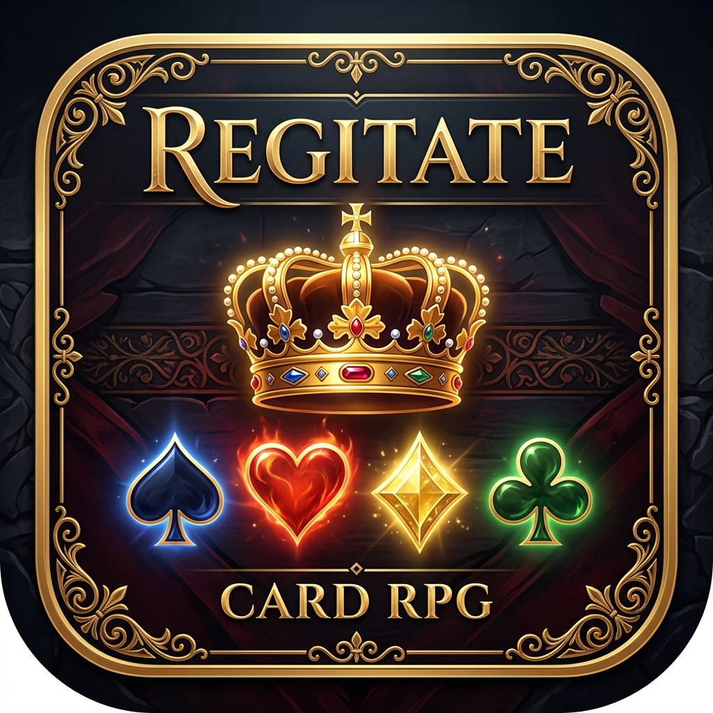

# Regitate for ANBERNIC RG Rotate

<p align="center">
  
</p>

Godot Engine 4.x (GDScript) で開発された、正方形ディスプレイ搭載Android携帯ゲーム機「**ANBERNIC RG Rotate**（720×720）」向けのソロ・トランプRPG『**Regitate**』です。  
名作協力型トランプゲーム「Regicide」のルールをベースに、物理ゲームパッド（十字キー・ABXYボタン）に最適化されたスムーズな操作体系とレスポンシブな正方形UIを実現しています。

---

## 🎮 操作方法（Controls）

| 操作 | 携帯機ボタン (ANBERNIC) | キーボード | 動作 |
|---|---|---|---|
| **カーソル移動** | **十字キー** (D-Pad `←` `→`) | `←` `→` | 手札内のフォーカス移動（自動スクロール追従 / -10px 浮揚） |
| **決定 / プレイ** | **A ボタン** (Joypad 0) | `Enter` / `Space` | 選択カードの出撃 / 単体カード即時プレイ / 防御確定 |
| **選択切替 (トグル)** | **X ボタン** (Joypad 2) | `X` | フォーカス中のカードを選択リストに追加 / 解除（-25px 浮揚 + ✓表示） |
| **パス (イールド)** | **Y ボタン** (Joypad 3) | `Y` | カードを出さずに敵の反撃フェーズへ進む |
| **キャンセル (全解除)** | **B ボタン** (Joypad 1) | `Escape` / `Backspace` | 複数選択状態をすべてクリア |

---

## ⚔️ コアゲームルール仕様（Regicide ソロ準拠）

### 1. デッキ構成
- **Castle Deck（敵城主 / 12体）**:
  - 下から順に **King (4枚)** → **Queen (4枚)** → **Jack (4枚)** をそれぞれシャッフルして積載。
  - **Jack**: HP 20 / 攻撃力 10
  - **Queen**: HP 30 / 攻撃力 15
  - **King**: HP 40 / 攻撃力 20
- **Tavern Deck（プレイヤー山札 / 40枚）**:
  - `A`〜`10` のカード（4スート × 10枚 = 40枚）。初期手札・上限枚数は **8枚**。

### 2. スート効果
- **クラブ（♣）**: 与ダメージが **2倍** に強化。
- **スペード（♠）**: シールド。敵の攻撃力を数値分 **永続軽減**（最低0）。
- **ダイヤ（♦）**: 数値分だけ Tavern Deck からカードを手札に **ドロー**（手札上限8枚）。
- **ハート（♥）**: 捨て札（Discard Pile）をシャッフルし、数値分だけ Tavern Deck の底に **回復戻し**。

### 3. 特殊ルール
- **スート耐性**: 敵と同じスートのカードは **ダメージのみ有効**（スート能力は無効化）。
- **エース（A / 相棒）**: 攻撃力 1。単体出しのほか、**他の任意のカード1枚とペア出撃** が可能（両方のスート効果が合算発動）。
- **セット出し**: 同一ランクのカード（ペア、トリプル、クアッド）は、**合計値が10以下** であれば同時出撃が可能（例: 2×5=10, 3×3=9, 4×2=8, 5×2=10）。
- **ぴったり撃破（Exact Kill）**: 敵の残りHP **ちょうど0** で倒した場合、その敵絵札（J=10, Q=15, K=20）を捨て札ではなく **Tavern Deck のトップに追加**（強力な味方カードとして手札にドロー可能）。
- **反撃フェーズ**: 敵が生き残っている場合、敵の現在攻撃力以上の防御値になるよう手札からカードを選択して捨て札にします。捨てきれない場合は **GAME OVER**。

---

## 📱 プロジェクト仕様

- **ゲームエンジン**: Godot Engine 4.x
- **レンダラー**: `gl_compatibility`（モバイルでの発熱抑制・省電力・低負荷）
- **画面解像度**: 720 × 720（1:1 正方形画面 / ANBERNIC RG Rotate ネイティブ）
- **ストレッチモード**: `canvas_items` / `keep`
- **画面方向**: `portrait` (固定)
- **パッケージ名**: `com.anbernic.regitate`

---

## 📁 ディレクトリ構成

```text
regitate/
├── project.godot            # プロジェクト設定・InputMap定義・アイコン設定
├── export_presets.cfg       # Androidエクスポートプリセット (com.anbernic.regitate)
├── icon.png                 # アプリアイコン
├── .gitignore               # Godot & Androidビルド除外設定
├── scripts/
│   ├── card_data.gd         # カードデータ・スート効果・ステータスモデル
│   ├── game_engine.gd       # デッキ・スート解決・Exact Kill・反撃計算エンジン
│   ├── card_view.gd         # カード単体UI制御（D-Padフォーカス/選択アニメーション）
│   └── main_game.gd         # メイン進行・InputMapディスパッチ・HUD同期
├── scenes/
│   ├── Card.tscn            # カードUIコンポーネント (75x110px)
│   └── Main.tscn            # 720x720 レスポンシブメインシーン (Top/Middle/Bottom)
└── build/
    └── regitate.apk         # Android用ビルド済み APK
```

---

## 🛠 ビルド & 実機インストール手順

### 1. APK のエクスポート (Godot CLI)
```bash
Godot_v4.7.2-stable_win64_console.exe --headless --export-debug "Android" ./build/regitate.apk
```

### 2. ADB 経由での実機インストール & 起動
```bash
# インストール
adb install -r ./build/regitate.apk

# アプリ起動
adb shell am start -n com.anbernic.regitate/com.godot.game.GodotApp
```