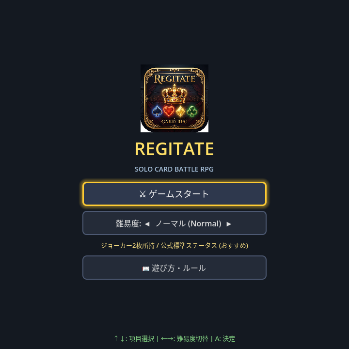
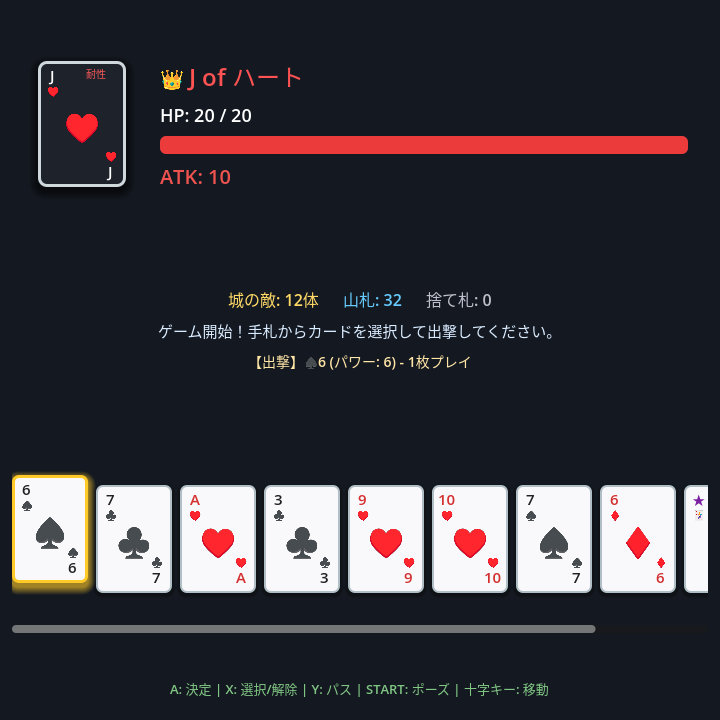
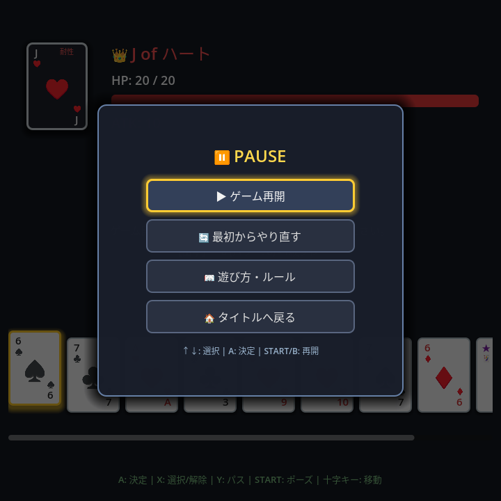

# Regitate for ANBERNIC RG Rotate

<p align="center">
  
</p>

Godot Engine 4.x (GDScript) で開発された、正方形ディスプレイ搭載Android携帯ゲーム機「**ANBERNIC RG Rotate**（720×720）」向けのソロ・トランプRPG『**Regitate**』です。  
名作協力型トランプゲーム「Regicide」のルールをベースに、物理ゲームパッド（十字キー・ABXYボタン・STARTボタン）に最適化されたスムーズな操作体系とレスポンシブな正方形UIを実現しています。

---

## 📸 スクリーンショット（Screenshots）

<p align="center">
  
  
  
</p>

<p align="center">
  <sub>左: タイトル画面（難易度切替） / 中央: バトル画面（手札＆敵ボス） / 右: ポーズ画面</sub>
</p>

---

## 🎮 操作方法（Controls）

| 操作 | 携帯機ボタン (ANBERNIC) | キーボード | 動作 |
|---|---|---|---|
| **カーソル移動** | **十字キー** (D-Pad `←` `→` `↑` `↓`) | 矢印キー (`←` `→` `↑` `↓`) | 手札フォーカス移動 / メニュー項目選択 / 難易度切替 |
| **決定 / プレイ** | **A ボタン** (Joypad 0) | `Enter` / `Space` | 選択カードの出撃 / 単体即時プレイ / 防御確定 / メニュー決定 |
| **選択切替 (トグル)** | **X ボタン** (Joypad 2) | `X` | フォーカス中のカードを選択リストに追加 / 解除（-20px 浮揚 + ✓表示） |
| **パス (イールド)** | **Y ボタン** (Joypad 3) | `Y` | カードを出さずに敵の反撃フェーズへ進む |
| **キャンセル / 戻る** | **B ボタン** (Joypad 1) | `Escape` / `Backspace` | 複数選択の全解除 / ポーズ画面を閉じる |
| **ポーズメニュー** | **START ボタン** (Joypad 6) | `P` / `Escape` | ポーズ画面を開く（再開 / リスタート / ルール確認 / タイトルへ） |

---

## 🌟 難易度設定 & 🃏 道化師（Joker）

タイトル画面でいつでもプレイスタイルに合わせた難易度を選択可能です。

| 難易度 | ジョーカー所持 | 敵ステータス (HP / ATK) | 特徴 |
|---|---|---|---|
| **カジュアル (Casual)** | **2枚** | Jack: 15/8, Queen: 25/12, King: 35/16 | 敵ATK・HP控えめ。初心者や気軽に楽しみたい方向け |
| **ノーマル (Normal)** | **2枚** | Jack: 20/10, Queen: 30/15, King: 40/20 | **公式推奨ルール**。適度な緊張感と手札事故救済のバランス |
| **ハード (Hard)** | **なし (0枚)** | Jack: 20/10, Queen: 30/15, King: 40/20 | ジョーカーなしの過酷なストイックモード |

### 🃏 道化師 (Joker) の能力
- **攻撃手番でのプレイ**:
  - 現在の**敵のスート耐性を完全無効化**（敵と同スートのカードでも全効果が発動可能に）。
  - さらに山札から手札が上限（8枚）になるまで**リフレッシュドロー**。
  - 敵の反撃は発生せず、プレイヤーの連続攻撃手番となります。
- **反撃フェーズでのプレイ**:
  - ジョーカー1枚を捨てるだけで、敵のいかなる攻撃力も**完全無効化（0ダメージ防御）**。

---

## ⚔️ コアゲームルール仕様（Regicide ソロ準拠）

### 1. デッキ構成
- **Castle Deck（敵城主 / 12体）**:
  - 下から順に **King (4枚)** → **Queen (4枚)** → **Jack (4枚)** をそれぞれシャッフルして積載。
- **Tavern Deck（プレイヤー山札 / 40枚）**:
  - `A`〜`10` のカード（4スート × 10枚 = 40枚）。初期手札・上限枚数は **8枚**。

### 2. スート効果
- **クラブ（♣）**: 与ダメージが **2倍** に強化。
- **スペード（♠）**: シールド。敵の攻撃力を数値分 **永続軽減**（最低0）。
- **ダイヤ（♦）**: 数値分だけ Tavern Deck からカードを手札に **ドロー**（手札上限8枚）。
- **ハート（♥）**: 捨て札（Discard Pile）をシャッフルし、数値分だけ Tavern Deck の底に **回復戻し**。

### 3. 特殊ルール
- **スート耐性**: 敵と同じスートのカードは **ダメージのみ有効**（スート能力は無効化）。
- **相棒(A)**: 攻撃力 1。単体出しのほか、**他の任意のカード1枚とペア出撃** が可能（両方のスート効果が合算発動）。
- **セット出し**: 同一ランクのカードは、**合計値が10以下** であれば同時出撃が可能（例: 2×5=10, 3×3=9, 4×2=8, 5×2=10）。
- **ぴったり撃破（Exact Kill）**: 敵の残りHP **ちょうど0** で倒した場合、その敵絵札（J=10, Q=15, K=20）を捨て札ではなく **Tavern Deck のトップに追加**（強力な味方カードとして使用可能）。
- **反撃フェーズ**: 敵が生き残っている場合、敵の現在攻撃力以上の防御値になるよう手札からカードを選択して捨て札にします。捨てきれない場合は **GAME OVER**。

---

## 📱 プロジェクト仕様

- **ゲームエンジン**: Godot Engine 4.x
- **レンダラー**: `gl_compatibility`（モバイルでの発熱抑制・省電力・低負荷）
- **画面解像度**: 720 × 720（1:1 正方形画面 / ANBERNIC RG Rotate ネイティブ）
- **ストレッチモード**: `canvas_items` / `keep`
- **画面方向**: `portrait` (固定)
- **パッケージ名**: `com.anbernic.regitate`

---

## 📁 ディレクトリ構成

```text
regitate/
├── project.godot            # プロジェクト設定・Autoload・InputMap
├── export_presets.cfg       # Androidエクスポートプリセット (com.anbernic.regitate)
├── icon.png                 # アプリアイコン
├── screenshot_title.png     # タイトル画面スクリーンショット
├── screenshot_game.png      # バトル画面スクリーンショット
├── screenshot_pause.png     # ポーズ画面スクリーンショット
├── .gitignore               # ビルド・キャッシュ除外設定
├── scripts/
│   ├── game_state.gd        # グローバル難易度・セッションシングルトン
│   ├── card_data.gd         # カードデータ・Joker・スート効果モデル
│   ├── game_engine.gd       # デッキ・スート解決・Exact Kill・反撃計算エンジン
│   ├── card_view.gd         # カードUI制御（リアルなトランプ比率・アニメーション）
│   ├── title_screen.gd      # タイトル画面制御（D-Pad難易度切替・メニュー）
│   ├── pause_menu.gd        # ポーズメニュー制御（STARTボタン連動・ポーズ中入力）
│   ├── rule_dialog.gd       # 遊び方・ルール説明モーダル制御
│   └── main_game.gd         # メインバトル進行・HUD同期
├── scenes/
│   ├── Title.tscn           # タイトルシーン（メインシーン）
│   ├── Main.tscn            # メインバトルシーン (720x720)
│   ├── Card.tscn            # トランプカードコンポーネント (76x108px)
│   ├── PauseMenu.tscn       # ポーズモーダルシーン
│   └── RuleDialog.tscn      # ルール説明モーダルシーン
└── build/
    └── regitate.apk         # Android用ビルド済み APK
```

---

## 🛠 ビルド & 実機インストール手順

### 1. APK のエクスポート (Godot CLI)
```bash
Godot_v4.7.2-stable_win64_console.exe --headless --export-debug "Android" ./build/regitate.apk
```

### 2. ADB 経由での実機インストール & 起動
```bash
# インストール
adb install -r ./build/regitate.apk

# アプリ起動
adb shell monkey -p com.anbernic.regitate -c android.intent.category.LAUNCHER 1
```